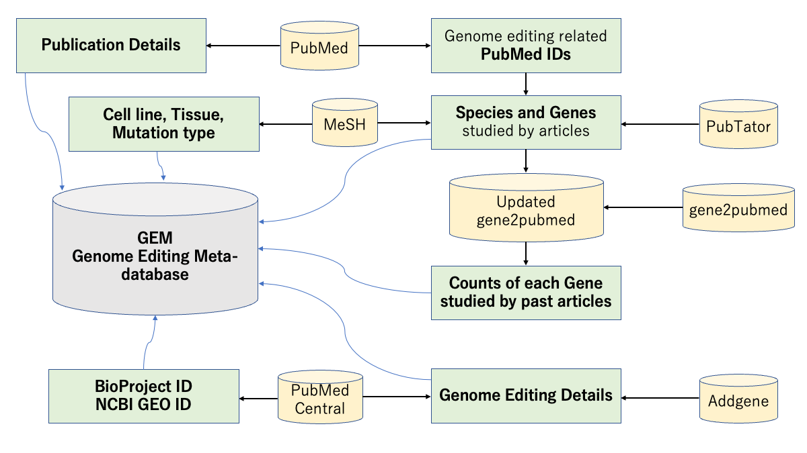
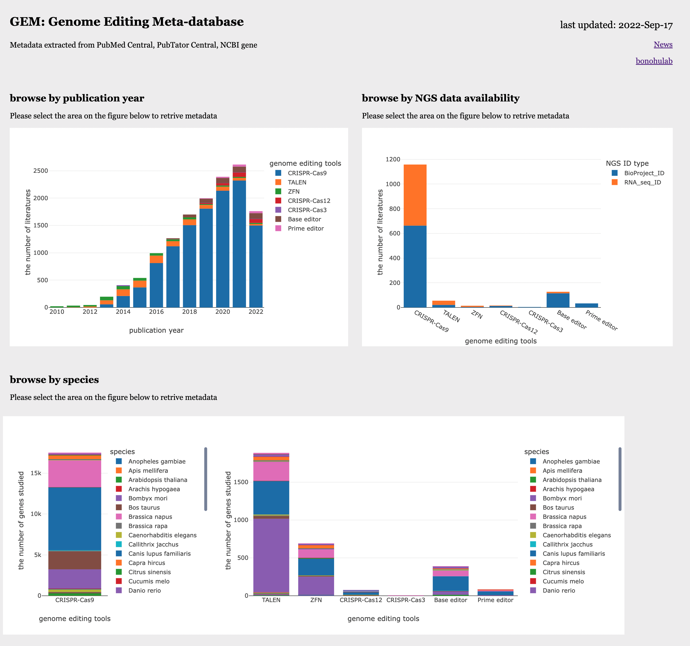
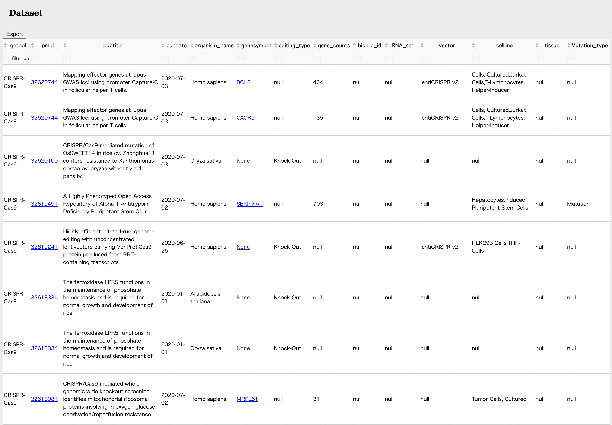

<!--

The paper.md, bibtex and figure file can be found in this repo:

  https://github.com/journal-of-research-objects/Example-BioHackrXiv-Paper

To modify, please clone the repo. You can generate PDF of the paper by
pasting above link (or yours) in

  http://biohackrxiv.genenetwork.org/

-->

# Abstract
Genome editing is a widely used tool to create precise changes in a genome. However, no specialized database for genome editing is available. Therefore, we have been developing genome editing meta-database (GEM) which aims to collect the exhaustive dataset of metadata related to genome editing. Currently, GEM consists primarily of a subset of genome editing-related metadata from PubMed articles. Metadata is extracted from research articles that have the contents with experiments using either of 7 types of genome editing tools: CRISPR-Cas9, Transcription activator-like effector nuclease (TALEN), Zinc finger nuclease (ZFN), CRISPR-Cas12, CRISPR-Cas3, Base editor, and Prime editor. Those tools are often used for knock-out or knock-in of genes to elucidate the biological functions of them. In domestic version of BioHackathon in 2022 (BH22.9), we have discussed the datasets and the usage of GEM, and also updated the scripts for GEM in [github](https://github.com/szktkyk/gem) based on the discussion.    
Keywords: genome editing, PubMed, MeSH, metadata, text-mining

# Introduction
Genome editing is a way to create precise changes in a genome by using specifically developed tools including CRISPR-Cas9, Transcription activator-like effector nuclease (TALEN), Zinc finger nuclease (ZFN), and so on. Genome editing works by generating targeted DNA lesions around that are resolved through DNA repair pathways with some changes in certain percentages [@nambiar_crispr-based_2022]. They have been often used in biological studies to investigate the gene functions. Since the convenient and efficient tool, CRISPR-Cas9, was reported in 2013 [@jinek_rna-programmed_2013], more research has been studied on various genes in a shorter period of time than before, and the number of literatures on experiments using CRISPR-Cas9 has increased [@wei_bibliometric_2022].

With genome editing technologies like CRISPR-Cas9 becoming more accessible, genome editing tools have been used to elucidate the biological mechanisms of various species. As we counted the specie MeSH term linked to publications, there are about 364 unique species experimented with genome editing tools in the past, [calculated by the script in github](https://github.com/szktkyk/gem/blob/main/modules/W06_CountTaxonomyMeSH.py). Although *Homo sapiens* (human) and *Mus musculus* (mice) are the two most target species to study so far as of 2022-Sep-17, the number of species and genes to study by genome editing is expected to keep growing for solving fundamental social problems such as food and energy shortage, treatment for genetic disorder, and acceleration of crop breeding. 

However, it would still take some time for researchers to plan or review their experiments with genome editing in current situation because there are no specialized dtabase to check the details of all successful genome editing cases before. The information about past genome editing cases is vital as the protocol differs in purposes of studies, target cell lines, and target species. For example, there are 4,703 vectors available for just CRIPSR-Cas9 for human cultured cells according to the [addgene website](https://www.addgene.org/search/catalog/plasmids/?q=CRISPR-Cas9&page_size=20&species=Homo+sapiens). The right vector needs to be chosen for the right cell line to succeed the efficient genome editing. There are also many other factors such as selection of tools implementation and editing position, affecting the results of genome editing experiments. As a reference for those cases above, a list to show all the details of past genome editing cases would be one of effective solutions. 

The details about genome editing cases (metadata) is usually contained in the research article, but not well accessible by conventional search in the literature databases such as PubMed due to differences in written forms of words depending on authors, articles, and species. Some databases such as [Genome Targeting Catalogue (GTC)](https://www.ebi.ac.uk/gtc/) maintained by European Bioinformatics Institutes (EBI) and [European Sustainable Agriculture Through Genome Editing (eusage)](https://www.eu-sage.eu/genome-search) have been providing the curated datasets related to genome editing. GTC provides a curated datasets of the targeted genes by experiments with CRISPR-Cas system, which includes 313 entries with 47 species as of 2022-Sep-17. Eusage has been curating the datasets of crops made by genome editing tools, which includes 594 entries as of 2022-Sep-17. The advantage of those two databases is that the dataset is curated and error-free. On the other hand, datasets are not exhaustive yet as they have less than 600 entries. 

Therefore, we have been developing genome editing meta-database (GEM) which aims to collect the exhaustive dataset of metadata related to genome editing. For a first step, we have chosen PubMed as the source to collect the metadata automatically based on the texts written in the PubMed/PubMed Central articles. This work has organized the past genome editing cases with species and genes, which will not only help researchers to know what has not been researched yet, but also enable a fast access to the genome editing related literatures a user might be interested in. 

# Results
During the domestic version of BioHackathon called BH22.9 in Kochi, Japan, we discussed some problems of GEM dataset and use cases of GEM. We have updated scripts based on the discussion in BH22.9.

## System overview to collect the metadata
<!--
    State the problem you worked on
    Give the state-of-the art/plan
    Describe what you have done/results starting with The working group created...
    Write a conclusion
    Write up any future work
-->

GEM's system to collect metadata is shown in Figure1. Genome editing related metadata from PubMed articles for [37 species](https://github.com/szktkyk/gem/blob/main/tax_list_dash.csv) was extracted based on following databases provided by NCBI. All the codes are available in [github](https://github.com/szktkyk/gem).

  - PubMed
  - PubMed Central (PMC)
  - NCBI gene
  - PubTator Central [@wei_pubtator_2019]
  - MeSH
  - NCBI taxonomy  

  

Species and genes of metadata are systematically and exhastively extracted by relying on the MeSH and PubTator linked to the each publication. In BH22.9, we have decided to add new metadata (`cell line`, `tissue`, and `mutation type`) into GEM using MeSH. They can be automatically extracted by reading the beginning of the each tree number of MeSH term (cell line for A11, tissue for A10, and mutation type for G05.365.590). Metadata named `literature counts` is the number of publications linked to the gene, showing roughly how much the gene has been studied in the past. This number is obtained from the personally updated gene2pubmed with genome editing related publications. Publication details (`PubMed Central ID`, `publication title`, `publication date`, and linked MeSH terms) are obtained from Entrez database using e-utilities. Other metadata (`genome editing tool`, `knock-out or knock-in`, `used vector for genome editing`, `BioProject IDs`, and `NCBI GEO IDs`) are mainly extracted from the full texts of PubMed Central by using regular expression.   
In turn, human curation error in MeSH and text-mining errors made in PubTator are limitations in this system. Also, since all the metadata is based on the research articles in PubMed, metadata from articles that are not registred in PubMed is not included in this database.   
As we implemented the automated metadata extraction system, the number of entries are 44,357 so far (as of 2022-Sep-17) based on 33,412 research articles processed. The current system can only find metadata for 37 configured species. If an article studies multiple `genome editing tool`, `species`, and `genes`, they are counted as separate entries. The current web user interface looks like the screenshots attached as Figure2 and 3.  

   

  

## Discussing the usage of GEM
GEM is the subset of PubMed articles that only contains using genome editing tools. Since the number of literatures using genome editing tools is more than 30,000 and expected to keep growing, it has been difficult for researchers to read all and keep up the versatility of usages of all the genome editing tools. GEM will be definitely useful for wet researchers who not only start constructing the experiment protocol using genome editing tools, but also review their experiemt protocols by confirming the trends with GEM database. We have discussed other potential usages with variety of people who attended the BH22.9.  

  - Use GEM to find all the expression data after genome editing: One of the projects in BH22.9 has aimed to investigate the mechanism of RNA off-target occured by each genome editing tool and develop the RNA off-target prediction software. As they need all the public RNA-seq data after genome editing, GEM makes it efficient. We have discussed the ways to collaborate, and we have shared the current genome editing metadata. 

  - Potential collaboration with [TogoDX](https://togodx.dbcls.jp/human/): We collected 21,254 entries that studying human genes (7746 genes) with 7 types of genome editing tools in 8188 research articles. As TogoDX/human provided by DBCLS could be one of the most integrated and effective way to visualize those entries, it was experimentally added to the test version of TogoDX. A user could start to choose data with `knock-out` or `knock-in` or `others`, then filter with genome editing tools to result corresponding genes. Since the data could be seen with other attribute keys such as pathways, it might help researchers to access the desired data quicker than before.

## Web User Interface (UI)
As GEM contains more than 40,000 entries with 14 types of metadata, the data needs to be easily searchable by users. We have developed the prototype of web user-interface. Our current web UI provides statistics of the dataset in four contexts: publication years, species, NGS data availability, and each genome editing tool (CRISPR-Cas9, TALEN, ZFN, CRISPR-Cas12, CRISPR-Cas3, Base editor, Prime editor) (Figure2). Users are able to interactively check the statistics by selecting the area in the statistical histograms. If an user clicks the selected area, the table corresponds to the selected dataset appears under the histogram figures, which can be exported to the local computer as comma separated value (csv). The whole dataset is also shown as the pagination table on the buttom of the web UI (Figure3). Each column of the table can be sorted or filtered and the filtered dataset can be exported as csv. 

<!-- ## Positive control
As GEM is the results of integration of a few databases and the results of text-mining from the full texts written in PubMed Central, it needs to include richer information than PubMed when it comes to the genome editing related metadata. We have looked for examples how exhastive dataset GEM inludes. 
  - 
  -  -->

# Future work

## Collection of more metadata
### Reduce empty metadata
There are still plenty of metadata shown as null especially cellline, tissue, and mutation type. We will work on finding other text-mining methods to fill in those null values. 

### Phenotypes
Currently, GEM contains the information of publication details, species, genes, and genome editing details. In the future, we would like to add information of the phenotype resulted from those genome editing studies. We will work on learing phenotype corpus of various species and text mining technologies using those corpus. 

### Expand species
As a first step, we have focused on 37 out of 364 species with genome editing experimented cases. We will eventually implement more species into GEM in the future. 
 <!-- mainly because the expression of genes are varied on species so that it has been difficult to comprehend all the rules yet. For example, genes for *Arabidopsis thaliana* and *Sus scrofa* (pig) are usually written in upper cases, but *Caenorhabditis elegans* and *Danio rerio* (zebrafish) in lower cases. Also, many of 364 species still lack annotated gene information and difficult for computers to text-mine the studied gene information.  -->

### Failed examples
If all the cases of experimental failures in genome editing is listed, it would be a useful reference for researchers not to do the same failure. Failed experimental data is often in supplemental data in an article and difficult for the computers to automatically access. We will work on how to collect knowledge from supplement in literature.

### Genome edited positions
Edited positions are also the important knowledge for the wet researcher to reproduce the experiments. However, this information is often on the figures and difficult for the cumputers to automatically access again. As much as failed examples, we will work on the text-mining the edited positions of geneome editing from the figures in articles. 

## Publish web user interface
We will set up a server and publish web UI and dataset in the near future. 

<!-- ## Build a server and Publish the databash
We will need to implement the followings to publish our database:
- build a server to publish a webpage
- publish a research article about GEM -->

# Acknowledgement
We deeply thank organizers of BH22.9 (domestic biohackathon in Japan) at Kochi (4-8 September 2022) for giving us a chance to discuss usage and dataset of GEM. 

# Github repository
[github_GEM](https://github.com/szktkyk/gem)

# References
